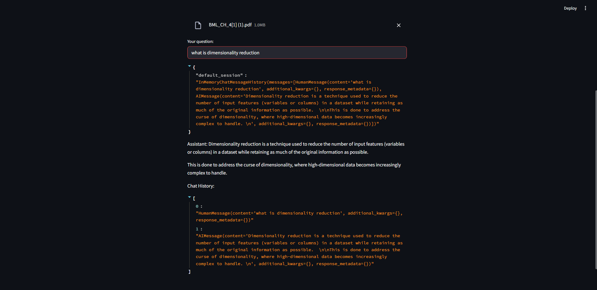

# RAG Q&A Conversation With PDF Chat Histor

A powerful Retrieval-Augmented Generation (RAG) application that allows users to upload PDF documents and have intelligent conversations with their content while maintaining chat history.



## Features

- 📄 **PDF Upload**: Support for multiple PDF file uploads
- 🤖 **Conversational AI**: Chat with your documents using Groq's Gemma2-9b-It model
- 🧠 **RAG Implementation**: Retrieval-Augmented Generation for accurate, context-aware responses
- 💬 **Chat History**: Maintains conversation context across sessions
- 🔍 **Smart Retrieval**: Uses ChromaDB for efficient document search
- 🌐 **Web Interface**: User-friendly Streamlit interface

## Technology Stack

- **Frontend**: Streamlit
- **LLM**: Groq (Gemma2-9b-It)
- **Embeddings**: HuggingFace (all-MiniLM-L6-v2)
- **Vector Database**: ChromaDB
- **Framework**: LangChain
- **Document Processing**: PyPDF

## Prerequisites

- Python 3.11+
- Groq API Key
- HuggingFace Token (optional but recommended)

## Installation

### Option 1: Using Conda (Recommended)

1. **Clone the repository:**
   ```bash
   git clone https://github.com/harsh-codess/rag-pdf-chat.git
   cd rag-pdf-chat
   ```

2. **Create conda environment:**
   ```bash
   conda create -n rag-qa-app python=3.11
   conda activate rag-qa-app
   ```

3. **Install dependencies:**
   ```bash
   conda install pip
   pip install -r requirements.txt
   ```

### Option 2: Using Environment File

```bash
conda env create -f environment.yml
conda activate rag-qa-app
```

## Configuration

1. **Create a `.env` file:**
   ```env
   HF_TOKEN=your_huggingface_token_here
   GROQ_API_KEY=your_groq_api_key_here
   ```

2. **Get API Keys:**

### Getting Your Groq API Key (Step-by-Step)

**For Non-Developers:**

1. **Visit Groq Console:**
   - Go to [https://console.groq.com/](https://console.groq.com/)

2. **Create an Account:**
   - Click "Sign Up" if you don't have an account
   - You can sign up using Google, GitHub, or email
   - Complete the registration process

3. **Access API Keys:**
   - Once logged in, look for "API Keys" in the left sidebar
   - Or go directly to [https://console.groq.com/keys](https://console.groq.com/keys)

4. **Create New API Key:**
   - Click "Create API Key" button
   - Give your key a name (e.g., "RAG-QA-App")
   - Click "Submit"

5. **Copy Your API Key:**
   - **IMPORTANT:** Copy the API key immediately and save it securely
   - You won't be able to see it again once you close the dialog
   - The key starts with "gsk_" followed by random characters

6. **Use the API Key:**
   - Paste this key into the Streamlit app when prompted
   - Or add it to your `.env` file as `GROQ_API_KEY=your_copied_key_here`

**Note:** Groq provides free API usage with generous limits, perfect for testing this application.

### Getting Your HuggingFace Token (Optional)

   - **HuggingFace Token**: Get from [HuggingFace Settings](https://huggingface.co/settings/tokens)
   - Sign up at [https://huggingface.co/](https://huggingface.co/)
   - Go to Settings → Access Tokens
   - Create a new token with "Read" permissions
   - Copy and add to your `.env` file

## Usage

1. **Start the application:**
   ```bash
   streamlit run app.py
   ```

2. **Access the web interface:**
   - Open your browser and go to `http://localhost:8501`

3. **Using the application:**
   - Enter your Groq API key in the input field
   - Set a session ID for your conversation
   - Upload one or more PDF files
   - Start asking questions about your documents
   - The AI will provide answers based on the document content

## How It Works

1. **Document Processing**: PDFs are loaded and split into chunks using RecursiveCharacterTextSplitter
2. **Embeddings**: Document chunks are converted to embeddings using HuggingFace's all-MiniLM-L6-v2 model
3. **Vector Storage**: Embeddings are stored in ChromaDB for efficient retrieval
4. **Query Processing**: User questions are contextualized using chat history
5. **Retrieval**: Relevant document chunks are retrieved based on query similarity
6. **Response Generation**: Groq's LLM generates answers using retrieved context

## Architecture

```
User Query → Context Awareness → Document Retrieval → LLM Processing → Response
     ↓              ↓                    ↓                ↓           ↓
Chat History → Question Reform → Vector Search → Context Injection → Answer
```

## File Structure

```
4.1-RAG Q&A Conversation/
├── app.py                 # Main application file
├── requirements.txt       # Python dependencies
├── environment.yml        # Conda environment file
├── .env                  # Environment variables (create this)
├── assets/
│   └── demo1.png         # Demo screenshot
└── README.md             # This file
```

## Features in Detail

### Chat History Management
- Sessions are managed by unique session IDs
- Chat history is maintained in memory during the session
- Previous context is used to improve question understanding

### Document Processing
- Supports multiple PDF uploads simultaneously
- Documents are chunked with 5000 character chunks and 500 character overlap
- Temporary files are created and cleaned up automatically

### Smart Retrieval
- Uses history-aware retrieval to understand context
- Reformulates questions based on chat history when needed
- Retrieves most relevant document sections for answering

## Troubleshooting

### Common Issues

**1. HF_TOKEN Error:**
```
TypeError: environment variable name must be str
```
- Ensure your `.env` file contains a valid HuggingFace token
- Check that the token is properly formatted without extra spaces

**2. Groq API Key Issues:**
- Verify your API key is correct and active
- Check your Groq account quota and usage limits

**3. PDF Processing Errors:**
- Ensure PDF files are not corrupted
- Check file permissions and accessibility

### Performance Tips

- Use smaller PDF files for faster processing
- Limit the number of simultaneous uploads
- Clear browser cache if interface becomes slow

## Contributing

1. Fork the repository
2. Create a feature branch
3. Make your changes
4. Test thoroughly
5. Submit a pull request

## License

This project is licensed under the MIT License - see the LICENSE file for details.

## Acknowledgments

- LangChain for the RAG framework
- Groq for the LLM API
- HuggingFace for embeddings
- Streamlit for the web interface
- ChromaDB for vector storage

## Support

If you encounter any issues or have questions, please:
1. Check the troubleshooting section
2. Review the configuration steps
3. Open an issue in the repository

---

**Happy chatting with your documents! 📚🤖**

---

**Made by Harsh Gidwani**
